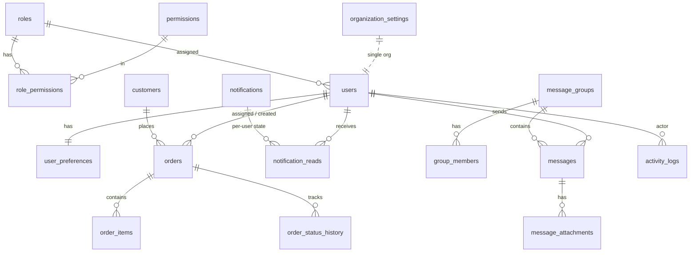

# Furnza — Delivered Orders & Customer Management System

A production-quality internal dashboard for tracking purchased & delivered customer
orders. Built to stay fast at **~1,000,000 customers and millions of orders**.

> **Status:** All phases complete & verified, including the spec-v6 modules —
> Production Schedule, Trending Products and Customer Feedback. See
> [Roadmap](#roadmap-expanded-spec-v3--15-phases) and the
> [Final QA checklist](#final-qa-checklist-phase-15).
>
> **Spec v6 additions (all browser + DB verified):**
> - **Production Schedule** (`/schedule`): kanban + per-printer Gantt timeline over
>   `print_schedule`, derived from the orders print state by a same-transaction
>   trigger (one source of truth, idempotent upserts keyed on `order_id`); drag =
>   real print actions with confirmations; sparse queue keys (one row per reorder);
>   capacity header + unassigned tray; completed cards auto-archive on the cron
>   after the configurable retention; overdue + printer-freed notifications.
> - **Trending Products** (`/trending`): research catalog with team voting
>   (incremental counts), card grid ⇄ DataTable toggle, estimated-margin pill vs
>   the configurable target, and race-safe idempotent promote-to-product.
> - **Customer Feedback** (`/feedback`): report → assign → resolve workflow with
>   required resolution notes, status history, @mention discussion, private-bucket
>   photos (signed URLs), saved filter presets, aging-SLA cron alerts, CRM
>   loop-back aggregates, the resolved-negative-feedback → apology-voucher
>   automation (exactly-once across reopen/re-resolve), and a pre-aggregated
>   analytics sub-tab on five materialized views.

---

## Tech stack

| Layer | Choice |
| --- | --- |
| Framework | **Next.js 16** (App Router, Turbopack, **React Compiler** enabled) |
| UI | **React 19**, **Tailwind CSS v4** (CSS-first `@theme`), **shadcn/ui** (new-york) |
| Animation | **Motion** (`motion/react`) |
| Language | **TypeScript 6** (strict) |
| Backend | **Supabase** — Postgres, Auth, Storage, Realtime, RLS |
| Data access | **Supabase JS client** (`@supabase/ssr`) everywhere + SQL migrations + generated types |
| Charts / forms / dates | Recharts · React Hook Form + Zod · date-fns |

### Why the Supabase JS client (not Prisma)

The spec requires **RLS as a real second enforcement layer**. The user-scoped Supabase
client runs every query as the signed-in user, so RLS applies automatically. Prisma
connects as a privileged role and bypasses RLS, and would still need raw SQL for the
scale features (pg_trgm/full-text, keyset-pagination, materialized-view analytics).
So: **Supabase JS client + SQL migrations + `supabase gen types` for end-to-end typing.**

---

## Prerequisites

- **Node.js 20+** (developed on Node 24)
- One of:
  - **Local Supabase** via the CLI (bundled as a dev dependency) — needs **Docker Desktop running**, or
  - A **cloud Supabase project** (free tier is fine)

---

## Quick start (local Supabase — recommended)

```bash
# 1. Install dependencies
npm install --legacy-peer-deps        # React 19 peer ranges → legacy-peer-deps

# 2. Start the local Supabase stack (Docker must be running). First run pulls images.
npm run db:start

# 3. Copy env and paste the keys printed by `supabase status`
cp .env.example .env
npx supabase status                   # copy Project URL + Publishable + Secret keys into .env

# 4. Apply migrations (schema, indexes, RLS, functions, storage) + reference data
npm run db:reset

# 5. (Optional) regenerate typed DB types
npm run db:types

# 6. Seed the default Admin + a small demo dataset
npm run seed

# 7. Run the app
npm run dev                           # http://localhost:3000
```

> This repo ships with the **default local Supabase keys already in `.env`**. If
> `supabase status` shows different values, paste those in. The current Supabase
> CLI uses the new key format (`sb_publishable_…` / `sb_secret_…`).

### Using a cloud project instead

```bash
npx supabase login
npx supabase link --project-ref <your-project-ref>
npm run db:push            # apply migrations to the cloud DB
npm run db:types:remote    # generate types from the linked project
# Put the cloud Project URL + anon (publishable) + service_role (secret) in .env, then:
npm run seed && npm run dev
```

After deploying migrations to cloud, **enable the auth hook**: Dashboard →
Authentication → Hooks → *Customize Access Token (JWT) Claims* →
`public.custom_access_token_hook` (already enabled locally via `config.toml`).

---

## Default credentials (from the seed)

| Role | Email | Password |
| --- | --- | --- |
| **Admin** | `admin@furnza.local` | `ChangeMe!2026` |
| Staff | `sara.lee@furnza.local` | `Password!23` |
| Staff | `sam.ortiz@furnza.local` | `Password!23` |
| Staff | `sofia.khan@furnza.local` | `Password!23` |

Override the admin via `SEED_ADMIN_EMAIL` / `SEED_ADMIN_PASSWORD` / `SEED_ADMIN_NAME`.
**Change these before any non-local use.**

---

## Environment variables

| Var | Description |
| --- | --- |
| `NEXT_PUBLIC_SUPABASE_URL` | Supabase API URL (local: `http://127.0.0.1:54321`) |
| `NEXT_PUBLIC_SUPABASE_ANON_KEY` | Publishable/anon key (safe for the browser) |
| `SUPABASE_SERVICE_ROLE_KEY` | Secret/service-role key — **server only, bypasses RLS, never expose** |
| `NEXT_PUBLIC_APP_URL` | App base URL (`http://localhost:3000`) |
| `SEED_ADMIN_EMAIL` / `_PASSWORD` / `_NAME` | Default Admin created by `npm run seed` |
| `SEED_BULK_CUSTOMERS` / `SEED_BULK_ORDERS` | Sizes for the opt-in bulk generator |

No secrets are committed; see `.env.example`.

---

## Scripts

| Script | What it does |
| --- | --- |
| `npm run dev` | Next dev server (Turbopack) |
| `npm run build` / `start` | Production build / serve |
| `npm run typecheck` | `tsc --noEmit` |
| `npm run db:start` / `db:stop` | Start/stop local Supabase stack |
| `npm run db:reset` | Recreate DB + apply all migrations + reference seed |
| `npm run db:push` | Apply migrations to a linked cloud project |
| `npm run db:types` / `db:types:remote` | Regenerate `database.types.ts` |
| `npm run seed` | Default Admin + small demo dataset (idempotent) |
| `npm run seed:bulk` | **Opt-in** bulk generator for scale testing (chunked 1k inserts) |

### Scale testing

```bash
SEED_BULK_CUSTOMERS=1000000 SEED_BULK_ORDERS=4000000 npm run seed:bulk
```

Generates faker data with client-side UUIDs + codes and batched 1,000-row inserts.
Not run by default (it would be expensive against a cloud project).

---

## Data model (ER overview)



Entities: `roles, permissions, role_permissions, users, user_preferences, customers,
orders, order_items, order_status_history, notifications, notification_reads,
message_groups, group_members, messages, message_attachments, activity_logs,
organization_settings, order_code_counters`.

Migrations live in [`supabase/migrations/`](supabase/migrations), `0000`–`0027`:
core schema/indexes (`0000`), auth trigger + JWT hook + RLS (`0001`), RPCs (`0002`),
reference seed (`0003`), storage (`0004`), then one migration per module wave —
products/inventory, profit matviews + pg_cron, CRM, marketing, messages v4
(polls/invite links/scheduler), printers & print tracking, cost calculator + VND,
analytics views, settings, activity-log v6 (monthly partitions + tamper-evident
hash chain), partition RLS hardening, and RPC grant hardening + in-function
permission guards (`0027`).

---

## Performance design (built in from Phase 1)

- **Indexes** on every searched/filtered/sorted column: order code (unique), status,
  priority, payment status, assigned staff, customer, and all date fields.
- **Fuzzy search** via `pg_trgm` GIN indexes on customer name/email/phone and order code
  — never a naive `LIKE %x%` scan. **Message bodies** use a `tsvector` GIN full-text index.
- **Keyset (cursor) pagination** supported by composite `(created_at desc, id desc)`
  indexes — no `OFFSET`, no live `COUNT(*)` on huge tables (`estimated_count()` RPC uses
  planner stats).
- **Money as integer cents** (bigint) — no float drift.
- **Bulk writes** in 1,000-row chunks (seed + CSV import).
- **Analytics** will be served from materialized views / summary tables (Phase 9).

## Security model

- **Auth:** Supabase Auth (email/password; reset & invite via email links → `/auth/callback`).
- **RBAC:** one permission matrix in [`src/lib/rbac/permissions.ts`](src/lib/rbac/permissions.ts)
  (Admin = all; Staff = scoped), mirrored into `roles/permissions/role_permissions`.
- **Enforced in three layers:** server guards (`requirePermission`), Postgres **RLS**
  on every table, and frontend conditional rendering.
- **O(1) role in RLS:** a `custom_access_token_hook` injects `user_role` into the JWT, so
  policies check role without a per-row DB lookup — essential at millions of rows.
- **Storage:** `avatars` (public read, self-write), `receipts`/`attachments` (private;
  cross-user reads via server-generated signed URLs).

---

## Assumptions

- **Local Supabase via the CLI** is the documented default (cloud is a drop-in via env +
  `db:push`). Chosen because it is zero-config beyond Docker and lets every phase be
  verified locally.
- **Seed = small demo + opt-in bulk generator** (we don't auto-insert millions).
- **Money stored as integer cents**; statuses/priorities are TEXT + editable in Settings
  (so no DB enums).
- **TS6 + supabase-js typing:** `@supabase/postgrest-js` deep result-inference doesn't
  fully resolve under the brand-new TypeScript 6, so query results are typed via
  `Pick<Tables<"table">, ...>` from [`src/lib/supabase/types.ts`](src/lib/supabase/types.ts)
  and cast at the data-access boundary. Runtime is unaffected.

---

## Roadmap (expanded spec v3 — 15 phases)

- [x] **Phase 1** — Setup, schema/indexes/RLS, storage, seed, default Admin _(verified: builds, typechecks, migrates, seeds; JWT role hook + admin RLS confirmed)_
- [x] **Phase 2** — Auth + app shell + 12-item permission-filtered sidebar + full RBAC matrix (incl. product/inventory/profit/CRM/marketing permissions)
- [x] **Phase 3** — Reusable DataTable (keyset cursor pagination) + shared export (CSV/branded PDF/print) + batched CSV import _(verified end-to-end; demo at `/dev/datatable`)_
- [x] **Phase 4** — User Management _(verified: invite/edit/deactivate/hard-delete, import/export, self-role-change blocked server-side + DB trigger)_ · **v4 upgrades verified:** Active/Deactivated/Banned status model (ban reason/by/at, red badge with tooltip, lift-ban; sync trigger keeps is_active consistent — it even blocks raw superuser psql), bulk actions (deactivate/ban/assign-role/export/soft-delete) with UI-proven self-exclusion (0 affected + disabled confirm) and last-active-Admin protection in every destructive path, one activity entry per affected user (`user.bulk_*`), per-admin pinned-users strip, GitHub-style 12-month heatmap from the incrementally-maintained `user_activity_daily` rollup, birthday/gender fields, type-to-confirm (email match) hard delete_
- [x] **Phase 5** — Customer Orders Hub _(verified)_ · **5b** 3D-print extension _(verified: printer/material/print-minutes fields with config-driven badges & filters, product-linked line items via catalog picker, filament grams → auto material cost, model-file uploads (.stl/.3mf/.step/.obj) with signed downloads, voucher redemption with rollback, Shipped/Delivered→Sale & Returned→Return movements (idempotent stamps), Delivered+Paid→CRM aggregates + tier engine (exactly-once))_
- [x] **Phase 6** — Activity Log + retro-wired log writes everywhere _(verified)_
- [x] **Phase 7** — Products & Inventory _(verified: 5-tab hub — catalog with images/categories/low-stock badges + live Realtime stock, append-only stock ledger with manual movements via the locking RPC (UI-tested: −18 → +20 → 2), suppliers CRUD, purchase orders create → receive-into-stock (UI-tested: PO-2026-000002, +25 purchase movement 114→139, stamped + activity-logged), production orders + BOM editor consuming components atomically; product CRUD/import/export on the shared DataTable. Variants are schema-ready; CRUD UI deferred — see Assumptions)_
- [x] **Phase 8** — Profit & Cost Analysis _(verified: 5 materialized views (product profitability, daily revenue/COGS, per-printer, per-material, inventory value) refreshed by pg_cron every 5 min — fixed a CONCURRENTLY-incompatible index that was failing the cron job; Admin-only /profit dashboard with date-scoped KPIs, animated revenue-vs-cost chart, margin bars, best/worst performers, printer & material breakdowns, product profitability table, CSV/PDF/print export; MVs not granted to authenticated — served via service role behind profit.view)_
- [x] **Phase 9** — Notifications (Realtime) _(verified live; incl. low-stock, assignment, delivered, tier-upgrade, voucher-issued, campaign-completed senders)_
- [x] **Phase 10** — CRM & Loyalty _(verified: customers list over incremental aggregates with tier badges + segment/tier/region/spend/orders/last-purchase filters and export; customer sheet with rank-history timeline (live engine output: Bronze→Silver auto with qualifying snapshots) + manual tier override (logged, notified); 15-tier ladder editor with thresholds/benefits; voucher management with batch generation + activate/deactivate; saved segments expanding to indexed predicates — verified the seeded "Repeat buyers" segment resolves correctly)_
- [x] **Phase 11** — Messages (Realtime + Storage) _(verified: live chat, attachments, edit/delete logged, FTS search)_ · **v5 advanced verified:** reply previews + jump-to, pin/star, **anonymous polls** (voter stored, never exposed — RLS visibility gate + own-votes-only API + Realtime under RLS), **invite links** (sha256 token at rest, scrypt + timingSafeEqual passwords, expiry/max-uses/revocation enforced atomically in the claim RPC, explicit join click so prefetch never consumes a link), unified **scheduler** (messages/reminders/polls; idempotent claim → double cron tick fires once), org-configurable reaction palette_
- [x] **Phase 12/13** — Marketing Automation _(verified end-to-end: campaign launched against a saved segment → resumable keyset enqueue (fixed a max(uuid) bug in the RPC) → batched dispatch through the pluggable provider layer (console adapter) → completed 3/3 with completion notification; cron re-runs send 0 (idempotent) and automation executions dedupe per occurrence; 5 default rules seeded with enable toggles; PUBLIC tracking endpoints (open pixel/click redirect/conversion — allow-listed in the auth middleware) roll into campaign_stats via the cron sweep, with open/click verified live; campaigns UI with create dialog (channels, audiences, merge tags, voucher, scheduling) + live-stats sheet + rules tab)_
- [x] **Phase 13** — Analytics _(verified: /analytics KPIs + top lists + printer utilization, all served from the pg_cron-refreshed matviews (0021) — no live scans; staff see own figures, admins company-wide)_ · **Dashboard v5 verified:** gradient count-up stat cards from cached aggregates, low-stock card, quick actions, recent orders/activity, Now Printing widget, VND everywhere (`300.000₫` dot-thousands) · **Cost Calculator verified:** Calculator | History sub-tabs in /profit, waste % + electricity kWh formulas, mint/amber/red margin status, history tiles + top-5 bars, Excel export, live "{n} saved" badge, `cost_calculations` with RLS + activity logging
- [x] **Phase 14** — Settings _(verified end-to-end in the browser + DB: 12 sections — profile incl. re-auth'd password change, preferences, notification prefs, company/branding, staff role permission matrix, orders & printing (statuses/priorities with badge palette + engine-status locks, order-code format with preview, custom fields, materials with per-gram cost, printer catalog with per-row save/deactivate/soft-delete), messaging, inventory, loyalty, marketing, data retention, security policy; every save logs to activity_logs; org sections hidden without `settings.*` grants)_
- [x] **Phase 15** — Final QA + feature checklist _(below)_

---

## Final QA checklist (Phase 15)

All verified against the running app + database on 2026-06-11/12:

- **RLS everywhere** — zero public tables without row-level security (incl. every
  monthly `activity_logs` partition, hardened in `0026`); materialized views carry
  **no grants** for `anon`/`authenticated` (served via service role behind `profit.view`
  / `analytics.view`); every `SECURITY DEFINER` function pins `search_path`.
- **RPC hardening (`0027`)** — no RPC is executable by `anon`; cron/claim/reconcile
  RPCs are service-role-only; the stock/CRM/voucher mutators
  (`apply_inventory_movement`, `apply_order_stock_movements`, `apply_order_to_crm`,
  `redeem_voucher`, `receive_purchase_order`, `complete_production_order`)
  **re-assert the caller's permission inside the function**, so a signed-in user
  hitting PostgREST `/rest/v1/rpc/*` directly is bounded by the same matrix as the
  UI (service role passes; attribution via `auth.uid()` is preserved).
- **Anonymous polls** — voter identity is stored but unreachable: the `poll_votes`
  SELECT policy only exposes other users' rows when `polls.visibility = 'public'`,
  the messages API selects own votes only, results come from the `poll_results`
  RPC (names only for public polls), and Realtime streams under the same RLS.
- **Invite links** — internal-only; raw token never stored (sha256 hash), passwords
  scrypt-hashed with per-link salt and compared with `timingSafeEqual`; expiry,
  max-uses and revocation enforced atomically inside the claim RPC; joining is an
  explicit POST so link prefetching can never consume a use.
- **Scheduler** — `/api/cron` is fail-closed (401 on missing *and* wrong
  `CRON_SECRET` Bearer); every step is idempotent (verified live: double tick →
  second run fires 0); activity-log hash chain reports 0 integrity mismatches.
- **API surface** — every route handler enforces a session + permission
  (`withPermission`/`withAuth`/`requirePermission`); the only intentionally public
  routes are the auth flows and `/api/track` (UUID-validated, recipient-bound,
  single-row writes, redirects restricted to http/https).
- **Server actions** — every exported mutation guards with
  `requirePermission`/`requireUser` before touching data, zod-validates input, and
  writes an `activity_logs` entry.
- **Pre-aggregation audit** — dashboard, /analytics, /profit and marketing
  analytics all read pg_cron-refreshed matviews / incremental aggregates; the
  only remaining per-request counts are bounded indexed slices (per-staff or
  ≤30-day ranges). Two regressions found & fixed in the final sweep: the
  30-second-polled sidebar orders badge now uses the planner estimate for
  `orders.view_all` holders (exact count stays for staff's own indexed slice),
  and the dashboard "orders this week" card now sums `mv_orders_daily` instead
  of counting base rows.
- **Money** — integer cents everywhere; all rendering through `formatMoney`
  (VND: dot thousands + trailing `₫`, no decimals).
- **Hygiene** — `tsc --noEmit` clean; ESLint flat config repaired
  (native `eslint-config-next` flat exports) → **0 errors**; no `console.log` /
  `TODO` / `debugger` left in `src/`; render-time `Date.now()` purity fix in the
  scheduler countdown (React Compiler safety, via `useSyncExternalStore`).
